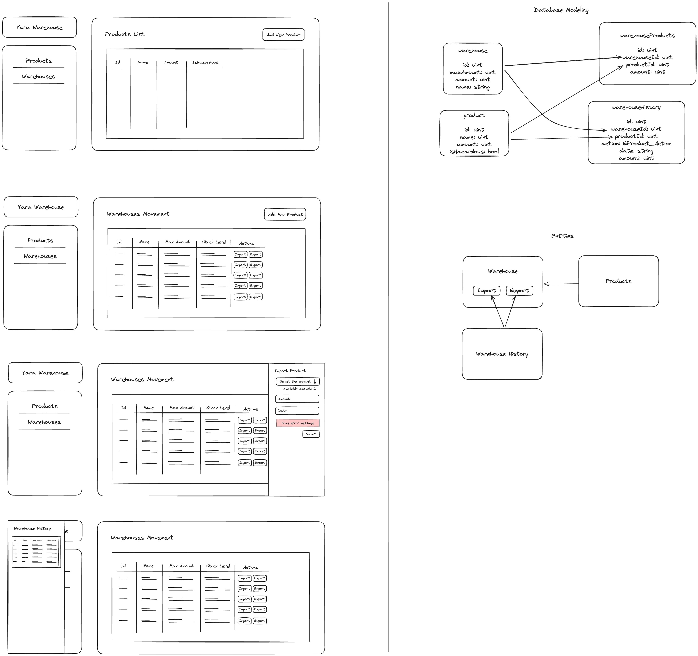

## Yara Stock Service
This is the service for managing yara warehouses and products of a given client. You can find a detailed diagram about how it works and what is the database modeling behind it by [clicking here](https://excalidraw.com/#json=5Q7IYSqHkzG5wYdwFWFef,LOQuzSuH0RqudjMNmjLVEg) or looking to this image bellow: 

 

You can find the GraphQL API playground here: https://yara-stock-service.onrender.com/graphql

If you run to run the service locally, you can follow these instructions bellow.

## Installation

```bash
$ npm install
```

## Running the app

```bash
# development
$ npm run start

# watch mode
$ npm run start:dev

# production mode
$ npm run start:prod
```

## Test

```bash
# unit tests
$ npm run test

# e2e tests
$ npm run test:e2e

# test coverage
$ npm run test:cov
```

## TODO - Nice to have:
- SEED
- TRANSACTIONS
- MIGRATIONS
- VALIDATIONS FACTORY

